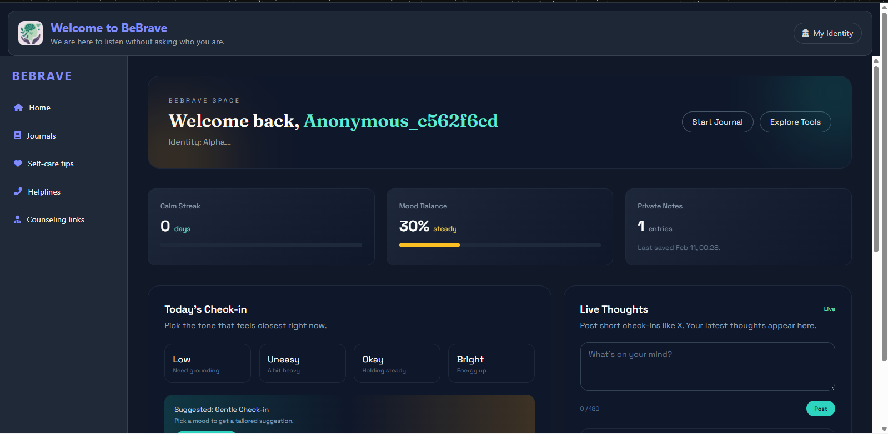

# BeBrave-🧠

## Project overview
BeBrave is a student mental health support platform focused on privacy and gentle check-ins. Users can create anonymous accounts, track their daily mood, and view a personalized dashboard with progress summaries, private notes, and live thoughts.

## Features implemented
- Anonymous quick signup and login
- Daily mood check-in (one per day, editable)
- Weekly calm prediction based on mood, stress, and sleep inputs
- Personalized dashboard stats (calm streak, mood balance, private notes)
- Live thoughts feed UI with likes and comments (frontend-only)
- Journal entries model for private notes tracking

## Tech stack used
- Backend: Django
- Frontend: Django templates, Tailwind CSS, Font Awesome
- Database: SQLite

## Steps to run the project locally
1) Clone the repository and open the project folder.
2) Create and activate a virtual environment.
3) Install dependencies:
	- `pip install -r requirements.txt`
4) Run database migrations:
	- `python manage.py makemigrations`
	- `python manage.py migrate`
5) Start the development server:
	- `python manage.py runserver`
6) Open the app in your browser:
	- `http://127.0.0.1:8000/`

## Screenshots
- 
- Add profile check-in screenshot here

## Roadmap
- Persist live thoughts, likes, and comments in the database
- Add journal entry creation and editing UI
- Add analytics for weekly trends and insights
